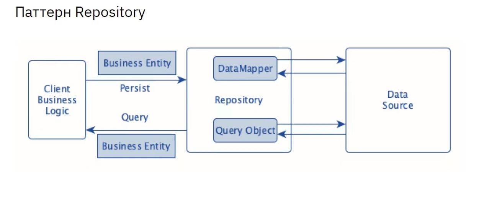

# Урок 10. Структура приложения с пользовательским интерфейсом и базой данных (паттерн Repository)
## Classwork
### Подходы к разработке проекта(эффективность разработки)

### Подходы к разработке проекта(основные подходы)

### Слои API Gateway архитектуры

### Паттерн Repository

### Паттерн External Configuration

### Паттерн Самодиагностика (Self-checking)

### USE CASE робота-пылесоса

## Homework
1) Разработать UseCase диаграмму для приложения управления роботом пылесосом

### UseCase_robot_vacuum_cleaner

2) Разработать UI/UX мобильного приложения управления роботом пылесосом
   Выполненную домашнюю работу выложить на свой GitHub в формате jpg

### UI_UX_FULL_robot_vacuum_cleaner

Инструменты:
https://www.figma.com/
https://app.diagrams.net/
https://www.dbdesigner.net/